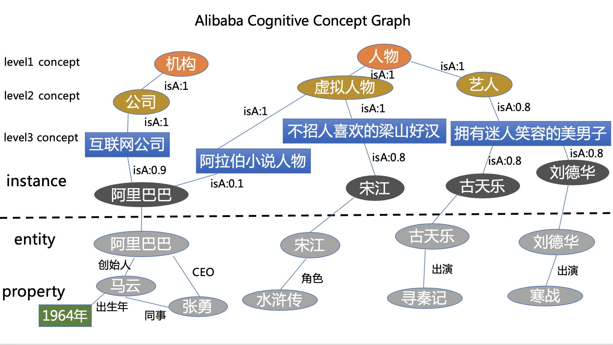
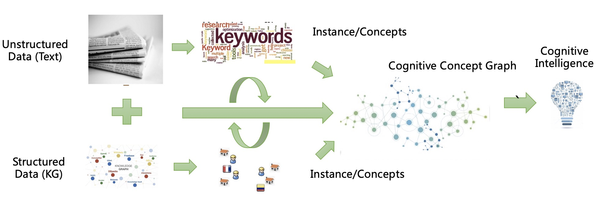

## Alibaba Cognitive Concept Graph (AliCG)

[](https://github.com/alibaba-research/CognitiveConceptGraph/blob/master/LICENSE)
[](https://github.com/alibaba-research/CognitiveConceptGraph/stargazers)
[](https://github.com/alibaba-research/CognitiveConceptGraph/network/members)
[](http://hits.dwyl.io/zxlzr/https://githubcom/alibaba-research/CognitiveConceptGraph)

## Abstract 

Concepts embody the knowledge of the world and facilitate the cognitive processes of human beings. Mining and constructing the cognitive concept graph are core research problems in text understanding and support many downstream tasks such as query analysis, knowledge base construction, recommendation, and search.  However, we argue that most prior studies extract formal and overly general static concepts from Wikipedia or static web pages, and previous taxonomies treat the concept as black and white.   In this paper, we describe our experience of implementing and deploying Alibaba Cognitive Concept Graph in Alibaba  UC  Browser. It discovers dynamic concepts at the right granularity conforming to user interests by mining a large number of concepts from text and knowledge graph.  The extracted concepts are dynamic over time.   We further present our techniques to tag documents with concepts, which has helped to improve the search and the recommendation in Alibaba UC Browser. We performed an extensive offline evaluation to demonstrate that our approach could extract higher quality concepts compared to several other existing methods. Our system has been deployed in Alibaba UC  Browser. Results from online A/B testing involving a large number of real users suggest that the Impression Efficiency of users increased by 5.5% after incorporating the concepts into both the search and recommendation framework of Alibaba UC  Browser.

## Motivation

The capability of conceptualization is a critical ability in natural language understanding and is an important distinguishing factor that separates a human being from the current dominating machine intelligence based on vectorization. Conceptualization helps humans generalize previously gained knowledge and experience to new settings, which may reveal paths to high-level cognitive **System 2** in a conscious way.  For example, the concept of "insects" allows people to understand all kinds of insects and grasp their commonalities without the entanglement of small differences between different insects. Establishing a concept extraction system to build a cognitive concept graph for hundreds of millions of things is a very important step for human beings to make their machines cognitive.  The importance of concepts is best emphasized by the statement in Gregory Murphy’s famous book The Big Book of Concepts that “Concepts embody our knowledge of the kinds of things there are in the world. 

Specifically, in the search business, conceptualizing search queries and documents is the cornerstone for understanding user needs and intentions.  For example, in a search scenario, we type in the search box:

**Can I eat durian when confinement in childbirth? (坐月子可以吃榴莲吗？)**

Generally, text matching technology can be used to calculate the similarity between query and document and recall based on a massive document database. The usual retrieval step is first to segment the query, then remove the stop words and adjust the corresponding weights of the term according to the feature information, such as part of speech. For documents and other content in the database, it is necessary first to build the inverted index, and then retrieve the documents according to the terms via algorithms such as  BM25, and sort those documents according to various LTR algorithms. Most retrieval systems are based on keywords or text features, which means that the words "confinement in childbirth" and "eat durian" must appear in the content of the document. At the same time, the semantics of the query will be missing with the removal of the stop words. The “confinement in childbirth” and “eat durian” become independent concepts. However, we usually understand  the above query like this:

**Confinement in childbirth(坐月子)-> Women during puerperium(产褥期的妇女)**

**Eat durian(吃榴莲)–>Eat tropical fruit (吃热带水果)**

The whole sentence means, “can women during puerperium eat tropical fruit? (产褥期的妇女可以吃热带水果榴莲吗?)” and we can naturally respond and reason.  The more appropriate result of this query is to retrieve the "Dietary contraindications for women during puerperium(产褥期的妇女饮食禁忌)" and other related documents. In NLP, data-driven approaches are relatively easy and achieve good results in the head scenarios, but there are also many challenges, such as long-tail queries, out-of-domain; lack of interpretability, etc..

## What is Alibaba Cognitive Concept Graph

In this paper, we propose the Alibaba Cognitive Concept Graph (AliCG), a large-scale dynamic knowledge graph at Alibaba that aims to discover and update concepts at the right granularity. Different from prior work, AliCG is not only based on mining web pages only but also mining from huge amounts of text and existing knowledge graphs. We present our design of AliCG and our experience of deploying it in Alibaba UC Browser, which has the largest market share in the Chinese mobile browser market with more than 300 million daily active users. 


The cognitive concept graph contains a lot of conceptual examples (including entities such as "Andy Lau" and non-entities such as "marry"), various granular concepts (such as "actor," "pink boy in the circle"), the isA relation between entities and concepts(such as "Andy Lau isA actor"), subclass of relation between concept and concept (such as "movie actor" is a subclass of "actor"). Usually, those relations are called isA relation. The Alibaba Cognitive Concept Graph is shown below:

**Level1**: The cognitive domain node, which expresses the domain to which the underlying node belongs.

**Level2**: The specific cognitive concept, expressing the abstract concept of the underlying node

**Level3**: The concept of fine-grained user cognition, the most important node  to express user fine-grained cognition

**Instance layer**: an instance of a concept, such as a conceptual mention phrase 

 

## Related Works 

There are several related works and we display them in the table bellow:

| Knowledge Graph    | Feature| Source| Refinement|
|  ----  | ----  |----| ----  |
| YAGO | Static |Text|No|
| Dbpedia | Static |Text|No|
| Microsoft Concept Graph | Static |Text|No|
| Tencent ConcepT | Static |Text|Yes|
| Alibaba Cognitive Concept Graph | Dynamic  |Text&KG|Yes|

## How do we construct? 

We leverage both raw text and knowledge graph to construct a cognitive concept graph. We also propose a novel refine the algorithm to make cognitive concept graph completion and concept verification automatically.  

 

## How to use?

The data structure of congitnve concept is show bellow(separeted by \t):

```
盲探	{"kg_info": [{"hot": "367", "guid": "bd77432e-4654-11e5-8ba6-f80f41fb03aa"}], "concepts": [{"concept": "影视", "score": 1.0, "level": 1}, {"isA": "影视", "concept": "电影", "score": 1.0, "level": 2}, {"concept": "影视节目", "score": 0.91, "level": 3}, {"concept": "好看的搞笑电影", "score": 0.03, "level": 3}, {"concept": "犯罪悬疑的影视作品", "score": 0.01, "level": 3}, {"concept": "杜琪峰高人气作品", "score": 0.01, "level": 3}, {"concept": "经典的搞笑电影", "score": 0.01, "level": 3}, {"concept": "杜琪峰影视作品", "score": 0.01, "level": 3}, {"concept": "刘德华经典电影", "score": 0.01, "level": 3}, {"concept": "第33届香港金像奖入围影片", "score": 0.0, "level": 3}, {"concept": "同为杜琪峰导演高人气电影", "score": 0.0, "level": 3}, {"concept": "心理犯罪的影视作品", "score": 0.0, "level": 3}, {"concept": "郑秀文刘德华电影", "score": 0.0, "level": 3}, {"concept": "刘德华与郑秀文电影", "score": 0.0, "level": 3}]}
```

### 1. Bag of Concepts

The simplest way to utilize the cognitive concept graph is to treat concepts as one-hot features as a bag of concepts way. 

### 2. Concept Embedding 

It is also possible to train concept embedding with random work or  node2vec.  You can leverage those pretrained concept embedding for downstream tasks.

### 3. Conceptualized learning 
It is helpful to leverage conceptualize leaning as the figure shows. Those leaned contextualized concept embedding the right part of the figure will benefit downstream tasks a lot. 

## Applications 

### Pretraining with Cognitive Concept Graph

There are lots of approaches that leverage knowledge for language pretraining, such see ERINE-baidu[1] and ERINE-tsinghua[2]. We also release [ChineseBLUE](https://github.com/alibaba-research/ChineseBLUE) for pretraining with knowledge in the medical domain. 

### Fintuneing downstream tasks

It is convenient to leverage concept knowledge directly via feature concatenation for downstream tasks such as intent classification, natural language Inference, question answering, named entity recognition. 

## Cite Cognitive Concept Graph

Paper will be released soon.

*  [Ningyu Zhang](https://zxlzr.github.io), Qianghuai Jia, Kangping Yin, Yulin Wang, Liang Dong, Feng Gao, Nengwei Hua. [Alibaba Cognitive Concept Graph: Mining Semantic Concepts for  Natural Language Understanding]()

```
@InProceedings{zhang2020conceptnet,
  author    = {Ningyu Zhang, Qianghuai Jia, Kangping Yin, Yulin Wang, Liang Dong, Feng Gao, Nengwei Hua},
  title     = {Alibaba Cognitive Concept Graph: Mining Semantic Concepts for  Natural Language Understanding},
  year      = {2020},
}
```

## Acoknowledment 

We also pay high respect to the "predecessors" of the concept graph include [Yago](https://www.mpi-inf.mpg.de/departments/databases-and-information-systems/research/yago-naga/yago/) from the Max Planck Institute in Germany,  [WordNet](https://wordnet.princeton.edu/) from Princeton University, [Wikidata](https://www.wikidata.org/wiki/Wikidata:Main_Page) From google, [Microsoft Concept Graph](https://concept.research.microsoft.com/)  from Microsoft Research Asia,  [Big Cilin](http://www.bigcilin.com/browser/)  from  Harbin Institute of Technology,  [CN-dbpedia](http://kw.fudan.edu.cn/cndbpedia/intro/)   from Fudan University. 

## Media Reports

[将门好声音 | 阿里高级算法工程师：机器具备认知能力的“神”操作！](http://www.sohu.com/a/343244524_610522)

[AICUG人工智能社区](https://www.slidestalk.com/AICUG)

## Disclaimer

This project is not the official product of Alibaba. The experimental results presented in the technical report only indicate the performance under the specific data set and super-parameter combination and do not represent the essence of each model. The experimental results may change due to random number seeds and computing devices. The content of this project is for technical research purposes only and is not intended to be a conclusive basis. The user may use the model arbitrarily within the scope of the license, but we are not responsible for any direct or indirect damages resulting from the use of the content of the project.

## References

[1] ERNIE 2.0: A Continual Pre-training Framework for Language Understanding

[2] ERNIE: Enhanced Language Representation with Informative Entities
